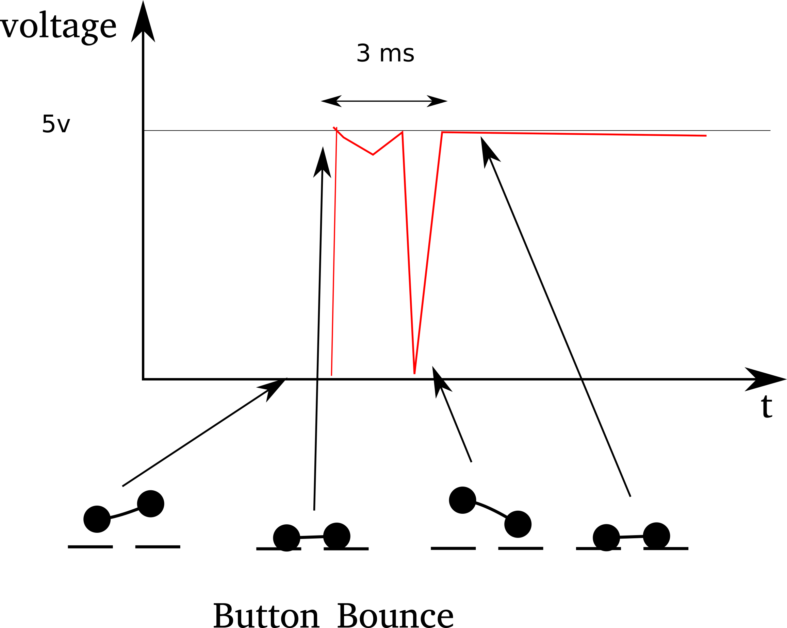

# Button Debounce Snippet

A button debounce snippet for Arduino device.

Button bounce happens when you push a tactile button. In a short period, the button
may close and open serveral times. But since the clock of microcontroller is fast enough to
capture the "noise", we need to get rid of unused peaks. Here is a figure showing what happen in the timeline.




## How to used debounce code

1. copy over `button_debounce_filter.h` and `button_debounce_filter.cpp`
2. start your program from the below example.
3. add your customzed button state logic code.

```c
#include "button_debounce_filter.h"


const int buttonPin = 2;
ButtonDebounceFilter buttonDebounce;

void setup() {
  // inital ButtonDebounceFilter with buttonPin
  buttonDebounce.begin(buttonPin);
  buttonDebounce.setDebounceInterval(50);

  Serial.begin(9600);
}

void loop() {

  buttonDebounce.monitorButtonState();

  bool is_high;
  bool is_low;
  buttonDebounce.isReliableHighLow(is_high, is_low);

  if (is_high) {
    // add your logic for button high
    Serial.println("button turn high");
  }

  if (is_low) {
    // add your logic for button low
    Serial.println("button turn low");
  }

  buttonDebounce.updateButtonState();
}
```

## What is done behind the scene

The intuitive idea of debounce a button is to ignore the former few jumps and
take the button state only when it is reliable. In my code:

1. monitor button voltage change, `monitorButtonState`
2. postone button voltage read until reliable `isReliableHighLow`
3. update button voltage, so next loop you can correctly recognize change `updateButtonState`


## Reference:

The code is a simple wrap on the code in these two post, but I found easier and cleaner to reuse later.
Hope you will enjoy it.

* [arduino official example](https://github.com/arduino/Arduino/blob/master/build/shared/examples/02.Digital/Debounce/Debounce.ino)
* [Tutorial 19 programming electronics](https://programmingelectronics.com/tutorial-19-debouncing-a-button-with-arduino-old-version/)

## License

The codes are under [MIT LICENSE](https://choosealicense.com/licenses/mit/)
